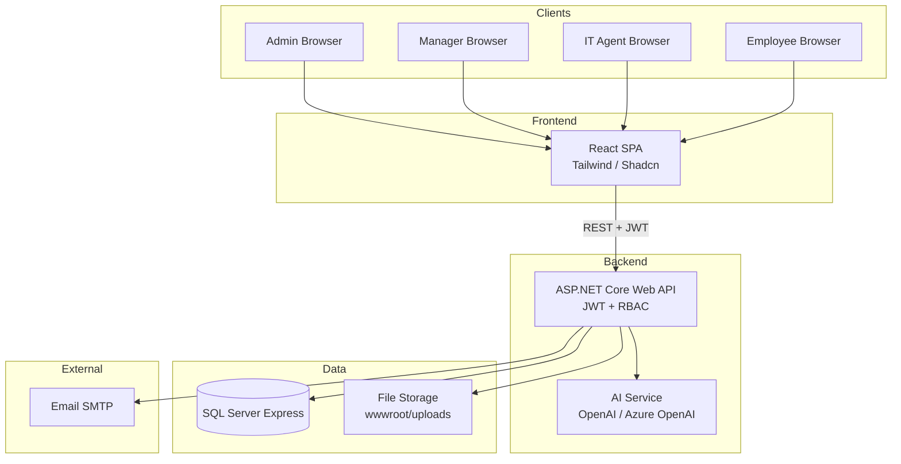
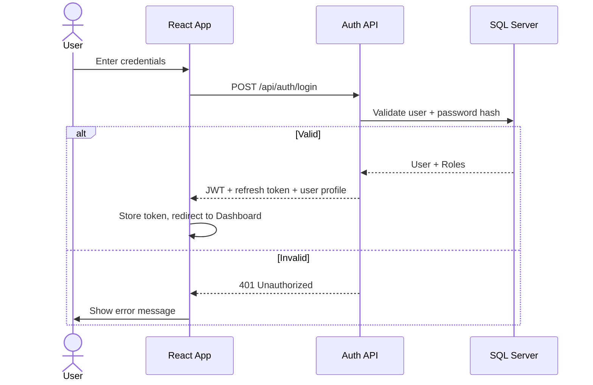
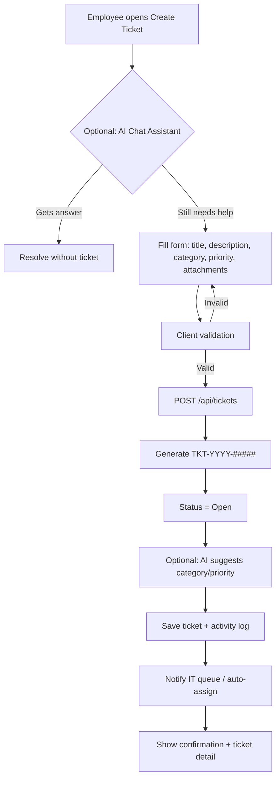
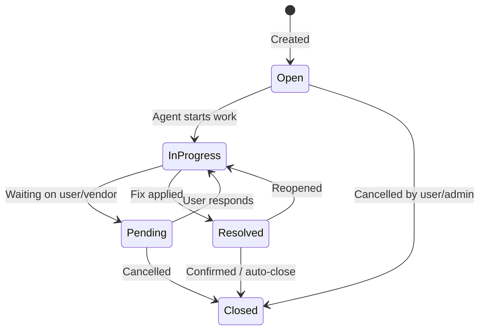
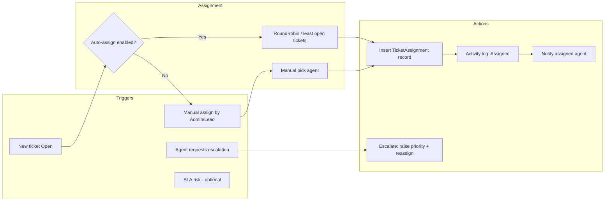
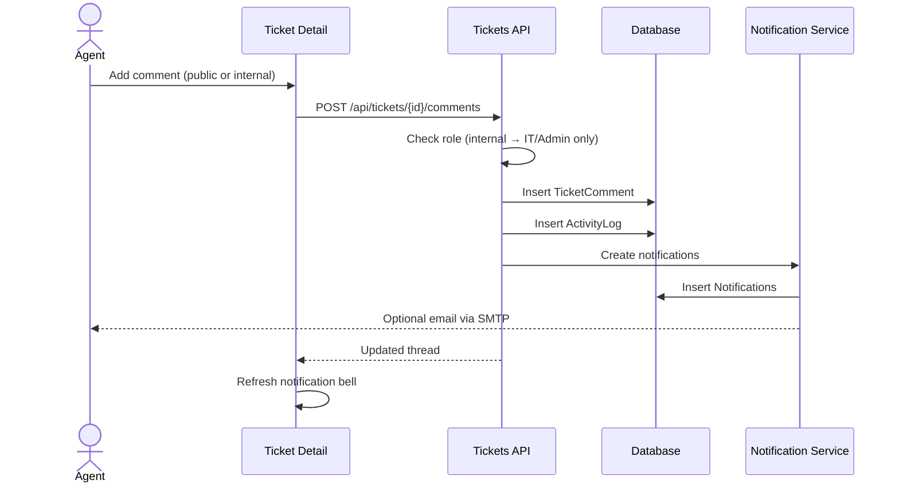
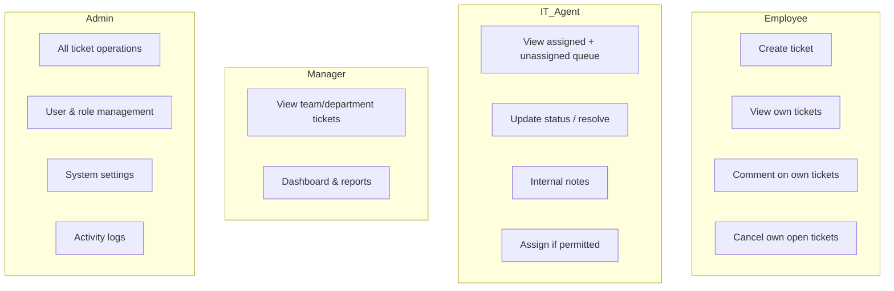
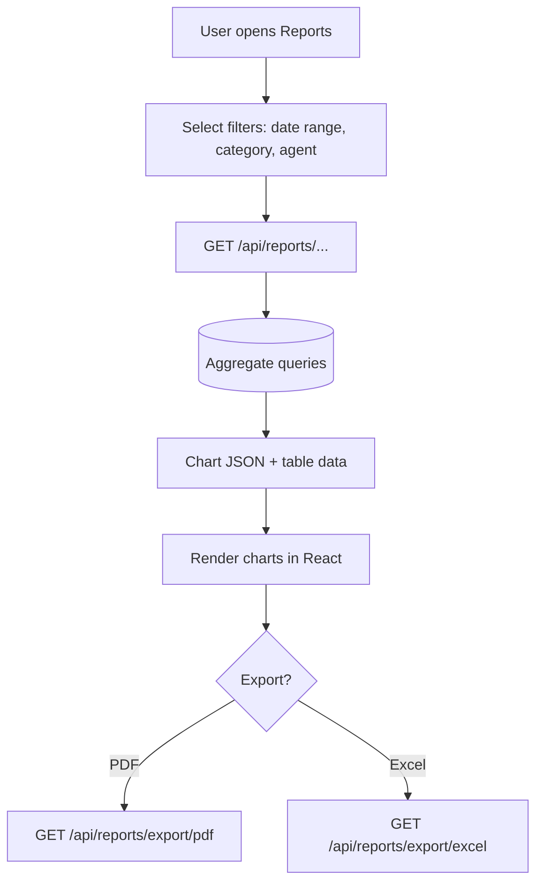
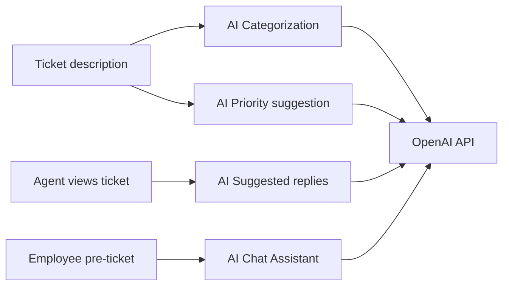
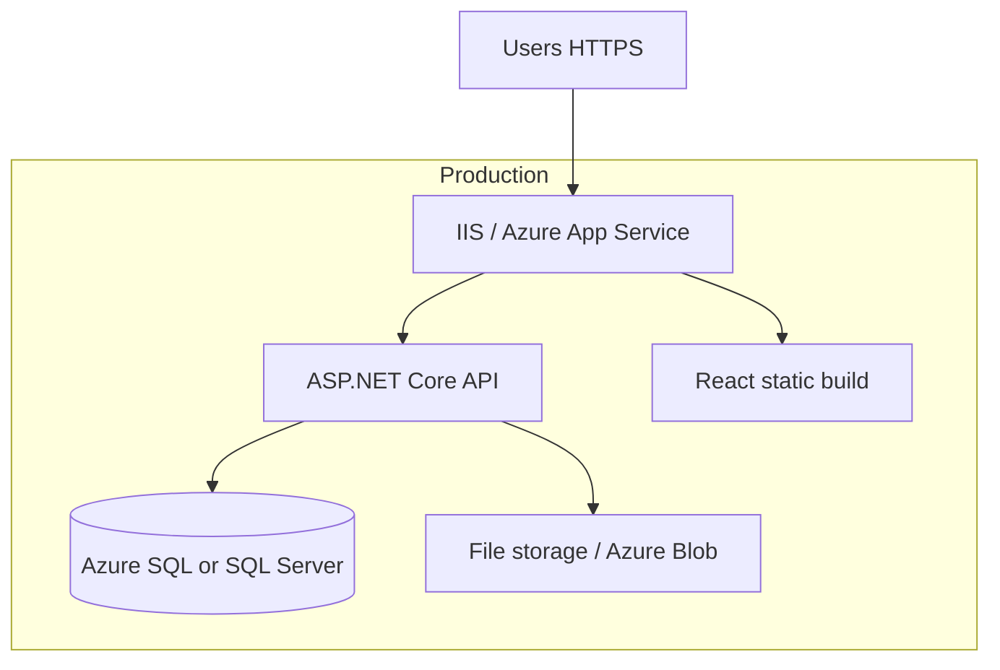

# System Workflows & Diagrams

Use these diagrams in presentations, Draw.io exports, or documentation. Equivalent **Draw.io** source: `diagrams/workflows.drawio`.

---

## 1. High-Level System Context

---

## 2. User Registration & Login Flow

---

## 3. Create Ticket Flow (Employee)

---

## 4. Ticket Lifecycle & Status Workflow

---

## 5. Assignment & Escalation Workflow

---

## 6. Comment & Notification Flow

---

## 7. Role-Based Access Overview

---

## 8. Report Generation Flow

---

## 9. AI Integration Flow (Week 6+)

---

## 10. Deployment Architecture (Target)

