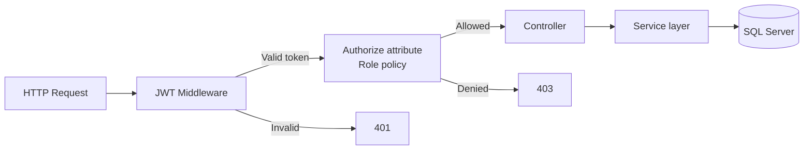

# Application Architecture

**Pattern:** Layered monolith (API + SPA) suitable for internship scope; can evolve to BFF or microservices later.

---

## 1. Solution Structure (Planned)

```
ITHelpDesk/
├── src/
│   ├── ITHelpDesk.API/              # ASP.NET Core Web API
│   │   ├── Controllers/
│   │   ├── Middleware/              # JWT, exception handling
│   │   ├── Program.cs
│   │   └── appsettings.json
│   ├── ITHelpDesk.Application/      # DTOs, interfaces, validators
│   ├── ITHelpDesk.Domain/           # Entities, enums
│   └── ITHelpDesk.Infrastructure/ # EF Core, Identity, email, AI, file storage
├── client/
│   └── it-helpdesk-web/             # React (Vite or CRA)
│       ├── src/
│       │   ├── components/
│       │   ├── pages/
│       │   ├── services/            # axios API client
│       │   ├── context/             # AuthContext
│       │   └── hooks/
│       └── package.json
├── database/
│   ├── schema.sql
│   └── seed-data.sql
└── docs/
```

---

## 2. Layer Responsibilities

| Layer | Responsibility |
|-------|----------------|
| **React SPA** | UI, routing, form validation, JWT in memory/localStorage, charts |
| **API Controllers** | HTTP, auth attributes, thin delegation to services |
| **Application Services** | Business rules: assignment, status transitions, notifications |
| **Domain** | Entities, enums (TicketStatus, Priority) |
| **Infrastructure** | EF Core DbContext, ASP.NET Identity, SMTP, OpenAI client, file I/O |

---

## 3. Technology Mapping

| Concern | Choice |
|---------|--------|
| Frontend | React 18+, React Router, Axios, Tailwind CSS, Shadcn UI (or MUI) |
| Backend | ASP.NET Core 8 Web API |
| ORM | Entity Framework Core 8 |
| Auth | ASP.NET Identity + JWT Bearer |
| DB | SQL Server Express |
| API docs | Swagger / OpenAPI |
| Charts | Recharts or Chart.js |
| AI | `HttpClient` → OpenAI REST |

---

## 4. API Module Overview (REST)

| Module | Base Route | Auth |
|--------|------------|------|
| Auth | `/api/auth` | Public (login/register), Authenticated (profile) |
| Users | `/api/users` | Admin |
| Tickets | `/api/tickets` | Role-based |
| Comments | `/api/tickets/{id}/comments` | Authenticated |
| Attachments | `/api/tickets/{id}/attachments` | Authenticated |
| Notifications | `/api/notifications` | Authenticated |
| Dashboard | `/api/dashboard` | Authenticated |
| Reports | `/api/reports` | Manager, Admin |
| Admin | `/api/admin` | Admin |
| AI | `/api/ai` | Authenticated |

---

## 5. Security Architecture



- **JWT claims:** `sub` (user id), `email`, `role` (Admin, Agent, Employee, Manager)
- **Password:** ASP.NET Identity hasher
- **Files:** Stored outside web root; download via authorized API endpoint
- **CORS:** Whitelist React dev server and production origin

---

## 6. Database Access

- **EF Core Code First** migrations aligned with `database/schema.sql` reference script
- **Repositories:** Generic `IRepository<T>` or direct DbContext in services for internship simplicity
- **Transactions:** Status change + activity log + notification in single transaction

---

## 7. Key Design Decisions

| Decision | Rationale |
|----------|-----------|
| Monolithic API | Faster delivery for 8-week timeline |
| Lookup tables for Category/Priority/Status | Admin can extend without code changes |
| TicketAssignment history table | Audit trail for internship requirement |
| Soft delete on Tickets | Preserve reporting integrity |
| Reference number in DB | Human-readable ID for support calls |

---

## 8. Week-by-Week Architecture Milestones

| Week | Architecture milestone |
|------|------------------------|
| 1 | ERD, workflows, wireframes (this document set) |
| 2 | API skeleton, Identity, JWT, React auth pages |
| 3 | Tickets module, EF entities |
| 4 | Assignment + comments + status machine |
| 5 | Notifications, uploads, dashboard API |
| 6 | Reports export, AI service abstraction |
| 7 | Integration testing, error boundaries |
| 8 | IIS/Azure deploy, README, Swagger publish |
