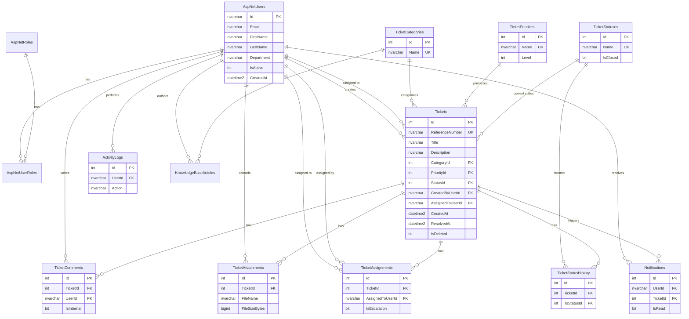

# Database ERD — IT Help Desk System

**Database:** SQL Server Express (`ITHelpDesk`)  
**Files:** `database/schema.sql`, `database/seed-data.sql`, `diagrams/erd.drawio`

---

## Entity Relationship Diagram (Mermaid)



---

## Table Summary

| Table | Purpose | Key relationships |
|-------|---------|-------------------|
| `AspNetUsers` | Identity + profile | Central user entity |
| `AspNetRoles` / `AspNetUserRoles` | RBAC | Admin, Agent, Employee, Manager |
| `TicketCategories` | Hardware, Software, … | → Tickets |
| `TicketPriorities` | Low → Critical | → Tickets |
| `TicketStatuses` | Workflow states | → Tickets, StatusHistory |
| `Tickets` | Core entity | Users, lookups |
| `TicketAssignments` | Assignment audit | Ticket, Agents |
| `TicketComments` | Public + internal notes | Ticket, User |
| `TicketAttachments` | Files | Ticket, User |
| `TicketStatusHistory` | Status audit trail | Ticket, Statuses |
| `Notifications` | In-app alerts | User, Ticket |
| `ActivityLogs` | Security audit | User |
| `PasswordResetTokens` | Reset flow | User |
| `SystemSettings` | Config key-value | — |
| `KnowledgeBaseArticles` | Optional KB | Category, Author |

---

## Reference Number Generation (Logic)

```
Format: {Prefix}-{Year}-{Sequence:00000}
Example: TKT-2026-00042

SQL Server sequence or MAX(Id)+1 per year in application service.
```

---

## Indexes (Performance)

- `Tickets`: StatusId, AssignedToUserId, CreatedAt
- `Notifications`: UserId + IsRead
- `ActivityLogs`: CreatedAt DESC

---

## How to Open ERD in Draw.io

1. Open [diagrams.net](https://app.diagrams.net) or VS Code Draw.io extension.
2. File → Open → `diagrams/erd.drawio`.
3. Export as PNG/SVG for your Week 1 submission.
